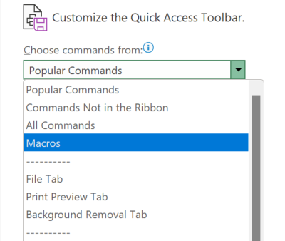

# Installation Guide

1. Download  `Batch Update Tool.xlam` to your computer. You may move this file to any location you want.
2. Open Microsoft Excel
3. If you have not enabled the Developer Tab in Microsoft Excel, right-click on any tabs and select **\[Customize the Ribbon...\]**

Then you can enable the Developer Tab by clicking the square box next to the "Developer" option to tick it, then click **\[OK\]**

4. Go to the Developer Tab and Click **\[Excel Add-ins\]**

5. In the Add-ins menu, Click Browse and locate the `Batch Update Tool.xlam` on your computer

6. Now you should see Batch Update Tool being added to the list, click **\[OK\]** to finish adding the Add-in to Microsoft Excel

7. Right-click on the Quick Access Toolbar (It is located below the Ribbons in the latest version of Microsoft Office, while it is located at the top-left corner of the window in older versions), then select **\[Customize Quick Access Toolbar...\]**

8. You would see the Excel Options window. Click on the selection box below the "Choose commands from:"

9. Select **\[Macros\]** from the list of options

10. You would see the two options (or more options if you have also enabled other Excel VBA Add-ins) 

Select `batch_update_tool` and click **\[Add >>\]** to add it to the Quick Access Toolbar. Do the same for `quick_action`.

11. After adding both Macros, you can click **\[OK\]** to finish the whole installation process. Alternatively, you can also select each of the Macros on the right-hand-side list and click **\[Modify...\]** to change the name and the icon of the button as you like.

