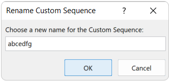
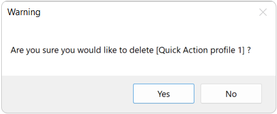
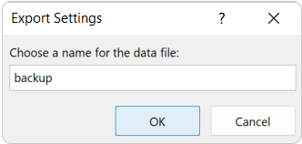
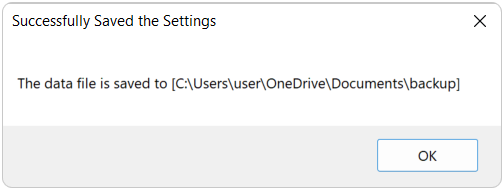

# User Guide

This User Guide aims to provide comprehensive instruction on all the features and options available in the *Batch Update Tool*, so you can utilize this tool to automate tasks as you want.

## Contents

[Get Started](#Get-Started)

[Configuring Different Mode](#Configuring-Different-Mode)

- [Batch Sheet Name Update](#Batch-Sheet-Name-Update)

- [Batch Cell Update](#Batch-Cell-Update)

- [Advanced Sheet Copier](#Advanced-Sheet-Copier)

[Configuring and Using Quick Actions](#Configuring-and-Using-Quick-Actions)

[Import and Export Settings](#Import-and-Export-Settings)

## Get Started

If you have already installed the Add-in to your computer based on the [Installation Guide](./Installation Guide.md), you can start using it by clicking the **\[batch_update_tool\]** at the Quick Access Toolbar to access the Configuration form. Another option is **\[quick_action\]**, which brings you to the Quick Actions list. More on that later.

### User Interface

#### Configuration Form for Batch Update Tool

When you first started the program, you will see a bunch of options and text boxes for changing the parameters. Don't worry, explanation and instructions on configuring the automation in different modes would be provided in the later parts of this user guide.

The interface of the configuration form is composed of different sections: 

**Quick Actions Configuration**

The upper part of the interface allows you to create, modify or delete different "Quick Actions profiles".

**Different Modes**

The middle part of the interface contains different tabs for different modes. You can select the mode you want by clicking the particular tab, then the parameters and options for configuring a particular mode would be shown.

**Other Options**

The lower part of the interface contains the remaining options of this program. The **\[Custom Sequence Settings\]** button takes you to the configuration form of Custom Sequence for adding or modifying different custom sequences. The **\[Import Settings\]** and **\[Export Settings\]** button allows you to import or export the configurations of your program, respectively. The **\[Help\]** button takes you to the User Guide for the selected mode, and the **\[Start\]** button starts the automation based on the parameters.

#### Quick Actions List

You can access the saved Quick Actions configurations by clicking the profile name that you would like to use. The Program would immediately start the automation or take you to the Configuration Form with the configuration of the selected profile added, depending on your settings.

### Different Modes

Batch Update Tool comes with different modes for updating the Workbook (i.e. Excel file) in batch. The available modes are as below:

**Batch Sheet Name Update**

In this mode, you can update the name of a range of sheets sequentially based on your configuration. You can use the built-in sequences and customize them with different parameters to suit your need.

**Batch Cell Update**

In this mode, you can update the value of a range of [cells](https://www.javatpoint.com/what-is-a-cell-in-excel) sequentially based on your configuration. You can use the built-in sequences and customize them with different parameters to suit your need. You can also create and use your Custom Sequence to fill in the cells.

**Advanced Sheet Copier**

In this mode, the program would copy a set of sheets multiple times based on your configuration. You can select a range of sheets to be copied, the position that the selected sheets are to be pasted, and the number of times the sheets would be pasted.

### Quick Actions Profiles

Quick Actions profiles allow you to save the current configuration (including all the parameters in different modes and the selected mode) to a profile. You can quickly load it in the configuration form or conveniently run it by selecting it in the Quick Actions List (if "Start immediately when selected" is enabled for that profile).

## Configuring Different Mode

Batch Update Tool comes with a variety of built-in sequences and each sequence includes different parameters for customizing its behavior. In this section, you will learn how to configure different parameters to customize the way the program automatically updates the sheet names / cell values.

### Batch Sheet Name Update

**Sequence String**

A *Sequence String* specifies the way of naming each of the sheets to be updated. You can type whatever words so it would be included in the name of every sheet, but you would need to include **exactly one** of the following *Sequence Specifiers* to indicate the position where the term (item) of a particular sequence would be located.

| Sequence Specifier | Meaning               |
| ------------------ | --------------------- |
| `#`                | Number Sequence       |
| `@`                | Month / Year Sequence |
| `%`                | Date Sequence         |

By combining words and specifiers, you can specify your way of naming the sheet. Here are some examples of Sequence String (with default settings) and their result:

| Sequence String | Name of the Sheets                                           |
| --------------- | ------------------------------------------------------------ |
| `Number-#`      | `Number-1` , `Number-2` , `Number-3` ...                     |
| `@ Schedule`    | `2022 05 Schedule` , `2022 06 Schedule` , `2022 07 Schedule` ... |
| `D-%-Timetable` | `D-01-05-2022-Timetable` , `D-02-05-2022-Timetable` , `D-03-05-2022-Timetable` ... |

**Number Sequence Options**

The Number Sequence Options allow you to customize the way a Number Sequence goes. There are three parameters that you can configure to change the behavior of the Number Sequence:

| Parameter         | Description                                                  |
| ----------------- | ------------------------------------------------------------ |
| Starting position | Specifies which number the number sequence would start from. The input can be any integers. |
| Step              | Specifies how much the number would increment by each iteration (i.e. How much the number would increase compared to the previous one). The input can be any number. |
| Round (D.P.)      | Specifies how many decimal places the number would be rounded (if the Step value is not an integer). The input can be any integers larger or equal to 0. |

**Month / Year Sequence Options**

The Month / Year Sequence Options allow you to customize the way a Month / Year Sequence goes. There are four parameters that you can configure to change the behavior of the Number Sequence:

| Parameter      | Description                                                  |
| -------------- | ------------------------------------------------------------ |
| Starting Year  | Specifies which year the sequence would start from. The input can be any valid year. |
| Starting Month | Specifies which month the sequence would start from. The input can be any valid month. |
| Step (Month)   | Specifies how many months would be incremented by each iteration (i.e. How many months passed compared to the previous one). The input can be any integer. |
| Format         | Specifies how the month/year would be displayed. Please refer to [Microsoft Documentations](https://docs.microsoft.com/en-us/office/vba/language/reference/user-interface-help/format-function-visual-basic-for-applications#date-symbols) for writing the format symbols to specify the month/year format. |

**Date Sequence Options**

The Date Sequence Options allow you to customize the way a Month / Year Sequence goes. There are three parameters that you can configure to change the behavior of the Number Sequence:

| Parameter     | Description                                                  |
| ------------- | ------------------------------------------------------------ |
| Starting Date | Specifies which date the sequence would start from. There are two options: - **Today:** The sequence would start form the system date (i.e. based on the current date when you execute the program) - **Specified Date:** The sequence would start from the inputted date. You need to input any valid date in (day/month/year) format. |
| Step (Day)    | Specifies how many days would be incremented by each iteration (i.e. How many days passed compared to the previous one). The input can be any integer. |
| Date Format   | Specifies how the date would be displayed. Please refer to [Microsoft Documentations](https://docs.microsoft.com/en-us/office/vba/language/reference/user-interface-help/format-function-visual-basic-for-applications#date-symbols) for writing the format symbols to specify the date format. |

**Sheet Range Options**

The Sheet Range Options specifies the range of sheets you want to change the name. There are two options:

| Options                                      | Description                                                  |
| -------------------------------------------- | ------------------------------------------------------------ |
| Update all the sheets in the active Workbook | Update the name of every sheet in the currently used Workbook (i.e. Excel file) sequentially from left to right. |
| Update from sheet idx                        | Update the name of the selected range of sheets in the currently used Workbook. You need to specify the starting index and the ending index of the range of sheets. The first (left-most) sheet has index equals to 1 and the last (right-most) sheet has index equal to the total number of sheets in that Workbook. |

### Batch Cell Update

**Sequence String**

Like Batch Sheet Name Update mode, a *Sequence String* specifies the way of filling in an Excel cell. You can type whatever words so it would be written to every cell, but you would need to include **exactly one** of the following *Sequence Specifiers* to indicate the position where the term (item) of a particular sequence would be located.

| Sequence Specifier | Meaning                                                      |
| ------------------ | ------------------------------------------------------------ |
| `#`                | Number Sequence                                              |
| `@`                | Month / Year Sequence                                        |
| `%`                | Date Sequence                                                |
| `$name$`           | Custom Sequence. You need to specify the name of the custom sequence by encapsulating it with a pair of `$` signs. |

Custom Sequence is a user-defined sequence that can only be used in this mode. You can create your own sequence and the program would iterate through the sequence in a loop. Configuration of Custom Sequence would be introduced in the later section.

By combining words and specifiers, you can specify your way of filling a cell. Here are some examples of Sequence String (with default settings) and their result:

| Sequence String | Name of the Sheets                                           |
| --------------- | ------------------------------------------------------------ |
| `Number-#`      | `Number-1` , `Number-2` , `Number-3` ...                     |
| `@ Schedule`    | `2022 05 Schedule` , `2022 06 Schedule` , `2022 07 Schedule` ... |
| `D-%-Timetable` | `D-01-05-2022-Timetable` , `D-02-05-2022-Timetable` , `D-03-05-2022-Timetable` ... |
| `Set $abc$`     | `Set a` , `Set b` , `Set c` ... (note that you need to have the corresponding Custom Sequence created beforehand) |

**Number Sequence Options**

The Number Sequence Options allow you to customize the way a Number Sequence goes. There are three parameters that you can configure to change the behavior of the Number Sequence:

| Parameter         | Description                                                  |
| ----------------- | ------------------------------------------------------------ |
| Starting position | Specifies which number the number sequence would start from. The input can be any integers. |
| Step              | Specifies how much the number would increment by each iteration (i.e. How much the number would increase compared to the previous one). The input can be any number. |
| Round (D.P.)      | Specifies how many decimal places the number would be rounded (if the Step value is not an integer). The input can be any integers larger or equal to 0. |

**Month / Year Sequence Options**

The Month / Year Sequence Options allow you to customize the way a Month / Year Sequence goes. There are four parameters that you can configure to change the behavior of the Number Sequence:

| Parameter      | Description                                                  |
| -------------- | ------------------------------------------------------------ |
| Starting Year  | Specifies which year the sequence would start from. The input can be any valid year. |
| Starting Month | Specifies which month the sequence would start from. The input can be any valid month. |
| Step (Month)   | Specifies how many months would be incremented by each iteration (i.e. How many months passed compared to the previous one). The input can be any integer. |
| Format         | Specifies how the month/year would be displayed. Please refer to [Microsoft Documentations](https://docs.microsoft.com/en-us/office/vba/language/reference/user-interface-help/format-function-visual-basic-for-applications#date-symbols) for writing the format symbols to specify the month/year format. |

**Date Sequence Options**

The Date Sequence Options allow you to customize the way a Month / Year Sequence goes. There are three parameters that you can configure to change the behavior of the Number Sequence:

| Parameter     | Description                                                  |
| ------------- | ------------------------------------------------------------ |
| Starting Date | Specifies which date the sequence would start from. There are two options: - **Today:** The sequence would start form the system date (i.e. based on the current date when the user executes the program) - **Specified Date:** The sequence would start from the inputted date. The user needs to input any valid date in (day/month/year) format. |
| Step (Day)    | Specifies how many days would be incremented by each iteration (i.e. How many days passed compared to the previous one). The input can be any integer. |
| Date Format   | Specifies how the date would be displayed. Please refer to [Microsoft Documentations](https://docs.microsoft.com/en-us/office/vba/language/reference/user-interface-help/format-function-visual-basic-for-applications#date-symbols) for writing the format symbols to specify the date format. |

**Sheet Range Options**

The Sheet Range Options specifies the range of sheets you want to update its cells. Different from Batch Sheet Name Update, there are three options:

| Option                                       | Description                                                  |
| -------------------------------------------- | ------------------------------------------------------------ |
| Update all the sheets in the active Workbook | Update the specified cells of every sheet in the currently used Workbook (i.e. Excel file) sequentially from left to right. |
| Single sheet only                            | Update the specified cells of currently active Excel sheets only. |
| Update from sheet idx                        | Update the specified cells of the selected range of sheets in the currently used Workbook. The user needs to specify the starting index and the ending index of the range of sheets. The first (left-most) sheet has index equals to 1 and the last (right-most) sheet has index equal to the total number of sheets in that Workbook. |

**Cell Range Options**

The Sheet Range Options specifies the range of cells you would like to update in a sheet. There are three options:

| Option                       | Description                                                  |
| ---------------------------- | ------------------------------------------------------------ |
| Fixed position in each sheet | Only update the "Starting cell" with the first item of the sequence. When this option is selected, the program would update the same cell in the subsequent sheet with the next item in the sequence. |
| Consecutive Row              | Updating the cell at the next row (one cell lower) at the next iteration. When this option is selected, the program would start from the first item in the sequence for every sheet to be updated. |
| Consecutive Column           | Updating the cell at the next column (the right-hand-size cell next to the current one) at the next iteration. When this option is selected, the program would start from the first item in the sequence for every sheet to be updated. |

There are also two parameters you need to specify for the Cell Range Options:

| Parameter     | Description                                                  |
| ------------- | ------------------------------------------------------------ |
| Starting cell | Specifies which cell the program would start updating from. The input can be any valid cell address (e.g. `A1`). |
| Repeat        | Specifies how many iterations the updating would occur. Note that if you selected "Fixed position in each sheet", the repeat value would be ignored. |

**Custom Sequence**

Custom Sequence is a user-defined sequence that can be used to update the value of the cell. To use a Custom Sequence, you would need to create one first by clicking the **\[Custom Sequence Settings\]** button on the bottom-left of the Configuration form.

A Custom Sequence Settings form would be shown:

<u>Create a New Custom Sequence</u>

1. Press **\[New\]** button to create a new Custom Sequence. You would be prompted to give a name of your sequence:

2. Type the name of the new Custom Sequence as you want and press **\[OK\]** button:

3. The Custom Sequence is now created. Now you need to specify the items in the sequence.

4. In the text box next to"Items:", type all the items for the sequence in order and separate each item with a comma ( `,` ) without space.

When you finished setting up your custom sequence, you can close the Custom Sequence Settings form by pressing the **\[X\]** button. The configuration would be saved automatically.

<u>Switching Between Different Custom Sequence</u>

1. If you have multiple Custom Sequences and you want to switch to another one, press the **\[▾\]** button next to the text box of "Sequence:".

2. All the Custom Sequences saved will be listed. Click on the one you want to switch to:

3. You have now switched to another Custom Sequence. The items of the selected sequence would be displayed and you can start editing it.

<u>Rename a Custom Sequence</u>

1. Press the **\[Rename\]** button to rename the currently selected Custom Sequence

2. You would be prompted to input a new name for the sequence.

3. Enter the new name for the Custom Sequence as you want and press **\[OK\]** button:

4. The name of the Custom Sequence is now changed.

<u>Delete a Custom Sequence</u>

1. Press the **\[Delete\]** button to delete the currently selected Custom Sequence.

2. You would receive a warning before you can delete the selected Custom Sequence. If you would like to proceed with deleting the Custom Sequence, press **\[Yes\]**

3. The Custom Sequence is now deleted and you can no longer access it.

<u>Using / Configuring a Custom Sequence</u>

To use a custom sequence, you can type the name of your Custom Sequence encapsulated with `$` sign in the Sequence String text box:

You can only use one Custom Sequence at once. The only parameter for configuring a Custom Sequence is "Custom Sequence Starting position", and you can find it below the Sheet Range Options section:

The Custom Sequence Starting position specifies which item the sequence would start from. The input can be at least 1 and at most the total number of items in the Custom Sequence. Since the Custom Sequence is finite, once the program iterates to the last item of the Custom Sequence, it would go back to the first item of the sequence in the next iteration.

### Advanced Sheet Copier

**Copy Range Options**

The Copy Range Options specifies the range of sheets you would like to copy. There are two options:

| Option                             | Description                                                  |
| ---------------------------------- | ------------------------------------------------------------ |
| Selected sheets in active workbook | Copy the currently selected (highlighted) sheets in the currently used Workbook (i.e. Excel file). More than one sheet can be selected. |
| Copy from sheet idx                | Copy the selected range of sheets in the currently used Workbook. The user needs to specify the starting index and the ending index of the range of sheets. The first (left-most) sheet has index equals to 1 and the last (right-most) sheet has index equal to the total number of sheets in that Workbook. |

**Paste Position**

The Past Position specifies the location the selected sheets to be pasted. There are three options:

| Option                | Description                                                  |
| --------------------- | ------------------------------------------------------------ |
| Ask everytime         | Prompt you to select a sheet position every time you run the program in this mode. |
| At the end            | The selected sheets would be pasted behind all the current sheets in the currently used Workbook (i.e. Excel file) |
| In front of sheet idx | The selected sheets would be pased in front of the n^th^ sheet in the currently used Workbook (where n is the index of the sheet). The first (left-most) sheet has index equals to 1 and the last (right-most) sheet has index equal to the total number of sheets in that Workbook. |

> <u>Prompt for the "Ask everytime" option</u>
>
> When "Ask everytime" is selected for Paste Position, you will see this prompt when you run the program in this mode. Press the **\[▾\]** button next to the text box of "In front of sheet:" and select the sheet from which all the selected sheets would be pasted front. Press **\[Confirm\]** to confirm your choice.
>
> 

**No. of Time**

The No. of Time parameter specifies how many times the selected sheets would be pasted (repeatedly). The input can be any integer larger or equal to 1.

## Configuring and Using Quick Actions

Quick Actions is a convenient way to save your current configuration for frequent or future uses. In this section, you will learn how to create, modify and conveniently access your configured Quick Action profiles.

<u>Create New Quick Action Profile</u>

1. To create a new Quick Action Profile, press the **\[New\]** button at the upper part of the configuration form.

2. You would be prompted to give a name of your sequence:

3. Type the name of the new Quick Action profile as you want and press **\[OK\]** button:

4. The new Quick Action profile is now created and loaded with default settings.

<u>Save the Changes to Quick Action Profile</u>

If you have made changes to the parameters and you would like to save it to the currently selected profile, press the **\[Save\]** button.

If you have made changes to the parameters and switch to another Quick Action profile / close the configuration form without saving, all your changes would be lost.

<u>Switching Between Different Quick Action Profiles</u>

1. If you have multiple Quick Action profiles and you want to switch to another one, press the **\[▾\]** button next to the text box of "Quick Actions:".
2. All the Quick Action profiles saved will be listed. Click on the one you want to switch to:

3. You have now switched to another Quick Action profile. The parameters of the selected Quick Action profiles would be loaded and the program would also switch to the selected mode for this Quick  Action profile.

<u>Rename a Quick Action Profile</u>

1. Press the **\[Rename\]** button to rename the currently selected Quick Action profile.

2. You would be prompted to input a new name for the profile.

3. Enter the new name for the Quick Action profile as you want and press **\[OK\]** button:

4. The name of the Quick Action profile is now changed.

<u>Delete a Quick Action Profile</u>

1. Press the **\[Delete\]** button to delete the currently selected Quick Action profile.

2. You would receive a warning before you can delete the selected Quick Action profile. If you would like to proceed with deleting the Quick Action profile, press **\[Yes\]**

3. The Quick Action profile is now deleted and you can no longer access it.

<u>The "Start immediately when selected" Option</u>

The "Start immediately when selected" option allows you to configure whether the selected Quick Action profile would be immediately executed when being selected in the Quick Actions List.

If you wish to do so, click on the square box next to "Start immediately when selected" to enable this option. Don't forget to save the profile again when you change this option.

To conveniently access a saved profile, open the Quick Actions List and click on the name of the profile you would like to execute.

If you select a profile with the "Start immediately when selected" option disabled, the program would take you to the configuration form with the selected profile loaded instead.

## Import and Export Settings

Batch Update Tool provides Import and Export features for sharing/backing up your configuration. In this section, you will learn how to import/export your configurations.

<u>Export Settings</u>

1. To export your settings (including all the configuration in all the quick action profiles and all the Custom Sequences), press the **\[Export Settings\]** button.

2. You would be prompted to give the name of your backup (data) file:

3. Type the name of the backup file as you want and press **\[OK\]** button:

4. You would be prompted to select a folder where the backup file would be saved. Select the folder through the file explorer and press **\[OK\]**.

5. The backup file is now saved to the destinated folder as an Excel file.

<u>Import Settings</u>

1. To import your configuration from a backup file, press the **\[Import Settings\]** button.

2. Since importing the settings from a backup file would wipe your current configurations, you would receive a warning before you can import the configuration from a file. If you would like to proceed with importing, press **\[Yes\]**

3. You would be prompted to select a backup file. Select the backup file through the file explorer and press **\[Open\]**.

4. The configuration is now imported to your Batch Update Tool. Press **\[OK\]** to close the configuration form. You need to reopen the configuration form to see the newly imported settings.

